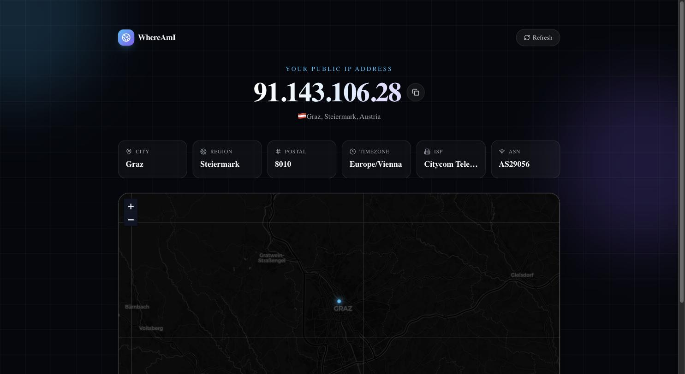

# WhereAmI

A modern IP lookup app built with Next.js — detects your public IP address, resolves its geolocation, and drops a live pin on an interactive map.

<p align="center">
  
</p>

<p align="center">
  
  
  
  
  
</p>

## Live Demo

### 🔗 [itsmrroot.github.io/PublicIP](https://itsmrroot.github.io/PublicIP/)

## Features

- **Instant IP detection** — resolves your public IPv4/IPv6 address on load, no sign-in required
- **Geolocation lookup** — city, region, country, postal code, timezone, ISP, and ASN
- **Interactive dark map** — your location plotted on a Leaflet/OpenStreetMap map with a pulsing marker and popup
- **Resilient fetching** — automatic fallback between IP providers if one is unavailable
- **Copy-to-clipboard** and one-click refresh
- **Modern, animated UI** — glassmorphism cards, gradient backgrounds, and Framer Motion transitions

## Tech Stack

| Layer     | Choice                                   |
| --------- | ----------------------------------------- |
| Framework | [Next.js 14](https://nextjs.org/) (App Router) |
| Language  | TypeScript                                |
| Styling   | Tailwind CSS                              |
| Animation | Framer Motion                             |
| Map       | Leaflet + React Leaflet (OpenStreetMap / CARTO tiles) |
| Icons     | Lucide                                    |
| IP data   | [ipwho.is](https://ipwho.is) with [ipapi.co](https://ipapi.co) fallback |

## Getting Started

**Prerequisites:** Node.js 18.18+ (Node 22 recommended)

```bash
# clone the repo
git clone https://github.com/itsmrroot/PublicIP.git
cd PublicIP

# install dependencies
npm install

# run the dev server
npm run dev
```

Open [http://localhost:3000](http://localhost:3000) in your browser.

### Other scripts

```bash
npm run build   # production build
npm run start   # serve the production build
npm run lint    # run ESLint
```

## Project Structure

```
app/                  Next.js App Router pages, layout, global styles
components/           IPMap, StatCard, MapErrorBoundary
lib/                  IP-fetching logic and shared types
.github/workflows/    CI pipeline
```

## How It Works

1. On load, the client fetches IP + geolocation data directly from a public API (`ipwho.is`, falling back to `ipapi.co` on failure).
2. The result — IP, city, region, country, postal code, timezone, ISP, and coordinates — renders into animated stat cards.
3. The coordinates are handed to a Leaflet map, which flies to the location and drops a pulsing marker with a popup.

Location is approximate, derived from IP geolocation — it typically resolves to the ISP's regional point of presence rather than your exact address.

## Deployment

This is a static, client-rendered app with no server-side secrets, so it exports cleanly with `next build` (`output: 'export'`) and deploys to any static host.

It's currently deployed to **GitHub Pages**: on every push to `main`, [`.github/workflows/deploy.yml`](.github/workflows/deploy.yml) builds a static export (with the `/PublicIP` base path GitHub Pages requires for project sites) and publishes it via GitHub's official Pages actions. It would deploy just as easily to [Vercel](https://vercel.com/) or [Netlify](https://www.netlify.com/) — for those, drop the `basePath`/`assetPrefix` config in `next.config.mjs`, since they serve from the domain root.

## License

No license has been set for this project yet.
